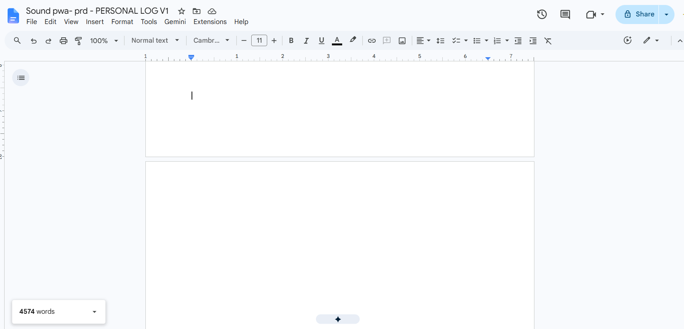

---

Like anything, there are pros and cons to learning to build without taking a course. 

**Pros:** individual control, flexibility, cost constraint not a thing anymore.

**Cons:** no actual designer or mentor for guidance or having any idea if you're fucking up or not. 

Just you and an internet-recommended outline of how an app development lifecycle should go.
My first real encounter with the latter stretched my product planning by four months.

## The Part Before I Got Stuck

I knew what sequence I needed to follow:

Write down the idea, expand on the why and for who, note down the features, figure out what the design would be and so on. Initially, the sequence made sense. 

But when I got down to starting the Product Requirements Document (PRD), things shifted. 
Instead of writing the idea, I also noted down the design principle. I had in mind the target audience already but I also wrote down who it wasn't for. While figuring out the features I wanted to add, I immediately started thinking of which of them wouldn't be possible; not because it was technically difficult but as it would have clashed against why I was building the product for. For example:

- Gamification was out because it clashed with my low pressure design principle.
- User accounts would require backend work I wasn't ready to tackle.

I jotted down the constraints, noted what to keep in V1 and what to park. Then came the natural next step. Figuring out the core sections and states. 

Since I already had a basic idea of what I wanted to keep and why, I started thinking through how the user would go through the app pretty easily. And rather extensively.

- *“What does the user see if all the permissions are granted?”*
- *“What does the user see if the permission is denied?”*
- *“What happens if the user changes tabs between recording/minimizes the browser?”*

I detailed everything from the state transitions to edge cases and failure states. Satisfied, I checked state mapping off my progress list and started with the IA.

**And stopped.**

From my understanding, the information architecture was the expected sequence of how the user will go through the app; what they would see and how they would interact with all elements. But that's exactly why I got stuck.

If the IA is supposed to be the part where I plan essentially the navigational map of the user through the app, what exactly was I writing all this while? Didn't I cover all this already? If yes, what am I supposed to do at this stage exactly? Draw the design? But that's supposed to be the next step after the IA… so, what is IA then?

I couldn't figure it out. I'd open the document, reread the same three questions, and close it again. Not because I didn't know what to write but because I genuinely believed I already had. That was the actual confusion: not 'I don't understand IA,' but 'I don't understand why I'm still being asked to do something I already did.' There's no productive way to sit with that. So I didn't.

Around this time, a website started looking a lot more interesting: I'd need a place for the app to live eventually anyway.

I started working on that: figuring out how to create a site as a non-technical person, [how to use VS Code](https://pixelpenwords.com/blog/simple-readme-over-complex-github-fix/), and so on. I paused the app PRD entirely and dedicated my energy entirely to [building PixelPenWords](https://www.pixelpenwords.com/blog/why-launching-my-website-felt-like-fraud/).

*This was back in February. Now it's July.*

## Cracking Through the IA Documentation

After I completed my-site-detour-that-technically-became-my-first project, I decided to focus back on my original aim. But when I sat down with it, the blockage was still there.
I pushed it off again and again until three days ago, I decided to stop avoiding it and complete the IA regardless of whether I understood it or not.

I took a different approach than I had been taking. I started thinking of it in terms of building a house. 

*A stock floor plan representing the shift in how I was thinking about IA.*

There was the state mapping stage (what the rooms in the house will contain) and the UI design (how each room will look). I needed to create a map of the house structure (the IA), detailing how the living room, kitchen and everything are connected, allowing people (users) to move through the rooms (states) without confusion (UI).

I started writing the navigational architecture accordingly: I named the states (default, active, etc.,) and wrote out how the user would visually move through the app, in prose instead of diagrams.

Thinking of it that way made it much easier to complete it. It wasn't a eureka moment by any means, but when I finished the IA documentation, it finally became clear where the block was actually coming from.

## Understanding The Blockage

No, it's not because IA is difficult (although it kinda is to me). The main problem was that I had been overcomplicating the whole thing too much. I had gone too detailed with the state mapping and confused myself by looking at each stage of the planning sequence at face value. 

In reality, state mapping and Information Architecture weren't competing with each other. They were answering different questions about the same product. 

- The state mapping helped me think through what happens within individual states. 
- The IA helped me think about how those states connect together as a complete product.

On paper, they looked surprisingly similar. In practice, they were doing completely different jobs. Once that finally clicked, finishing the IA felt... surprisingly straightforward.

## What This Taught Me About Documentation

The biggest thing I learnt is that things that look similar aren't necessarily doing the same job.

IA and state mapping.

Screen states and component states.

Similar in some ways but they answer different questions and serve different purposes; both equally important to define for your product.

Well, *that* and I realised how much I dread documentation, which is pretty ironic given I'm a writer.

But like state mapping and IA, those too are different. Writing an article is an act of exploration; you start with a question, research and discover the shape of the piece as you go. Writing for pleasure is different too. You create the world and the characters and they dance on the paper to piece together a story. Documentation asks for something different. It asks me to take something that already exists in my head and describe it precisely enough that someone else can follow it.

However, delving into the philosophy of writing identity calls for another day. I must go and focus on my next step: creating a low-fidelity UI in Figma for the first time. Can't wait!