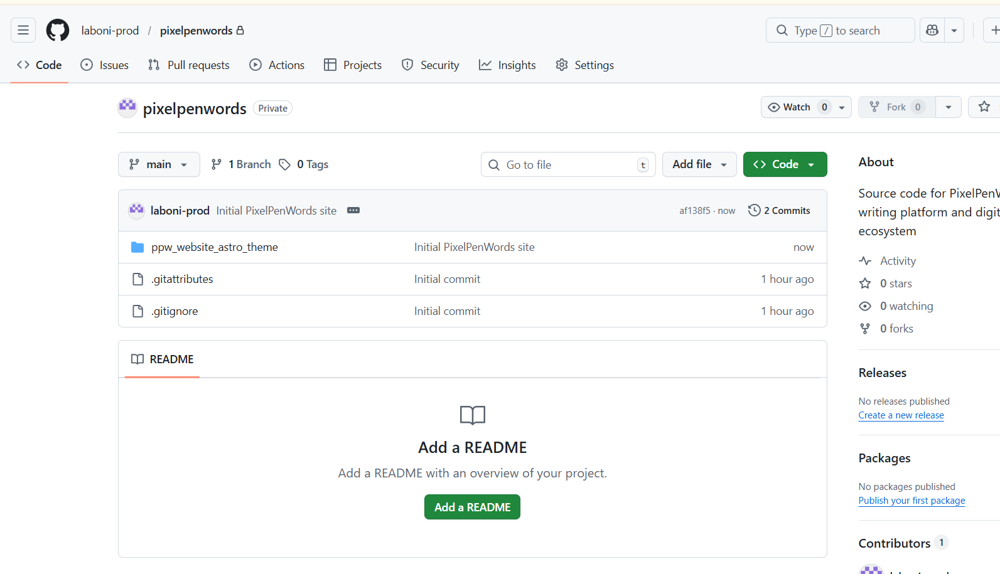

_**Note:** TLDR: I spent 2–3 days trying to fix what I thought was a serious GitHub repo structure issue, only to realize nothing was broken. Instead of overengineering a cosmetic fix, I solved it with a simple README note. **Sometimes the smartest move is communication, not complexity.**_

One thing that has become common in my relatively short-term learning experience so far is this:

- I get an idea
- I try to find ways it can work
- Start working on it

But then I discover three new complications that require me to learn an entirely new, even more complicated thing immediately to fix Problem No. 1… That wasn't even a problem 5 minutes ago.

Honestly, that’s a pretty standard part of learning anything, so I wasn’t too surprised when it became a pattern for me.

**Until one such issue took up 2-3 days of my time… only for the solution to be embarrassingly simple.**

## The conversation that started it all 

Full transparency first.

I do use ChatGPT as a thinking partner once in a while.

Sometimes it's to sanity check things and get explanations about technical terms I hadn't heard of. But mostly because when you're learning three tools simultaneously without a course or guide to show you the ropes, it helps to ask someone questions without feeling embarrassed every five minutes.

So, yeah, I was talking to Chat, asking it innocent questions that I imagine many beginners ask in one form or another:

_Was I doing well enough?_

I had made around 15 commits in my first week of properly using GitHub while also learning Astro, Tailwind, and VS Code. To me, that number meant nothing on its own. Was it slow? Was it decent? Was everyone else doing fifty while I was celebrating fifteen?

Chat said that 15 commits in week one were actually solid, especially because I was building while learning instead of just watching tutorials.

Naturally, I was stoked for about 2 minutes… until I showed it a screenshot of my repo.

## The problematic non-problem 

While reviewing my repo, ChatGPT pointed out something that I hadn't even realised was a thing.

**My actual website was sitting inside a nested folder named ppw_website_astro_theme instead of the repo root.**

Ideally, the structure should be something like this:

```bash
pixelpenwords/
  src/
  public/
  package.json
```

But mine was something like this:


```bash
pixelpenwords/        ← repo root (GitHub sees this)
  ppw_website_astro_theme/   ← my actual project
    src/
    public/
    package.json 
```

## How the Nesting Happened

It didn't take me long to recognise the cause.

When I had first downloaded the Astro theme I wanted to customize, I downloaded it as a zip file and extracted it into a PixelPenWords subfolder inside my Side Projects folder. I usually separate projects I’m working on into different folders in the File Explorer. I did the same in this case and didn't think much of it.

I was running dev mode through Command Prompt and using Visual Studio Code to make edits in the code.

### Why I chose that route

At that point, navigating VS Code felt like being plopped into a foreign country while sleeping and waking up to a totally different reality. 

I didn't want to focus on the giant that was GitHub yet, so I was manually making zip folders of the edited file with the last updated date. I figured I’d get used to VS Code, then create a GitHub account. That’s what I did; I downloaded GitHub Desktop and started setting things up. 


*My pre-GitHub version control system.*

**Of course, I struggled at first. Like, a lot.**

I couldn’t figure out what repositories are or pulling/pushing at first. So, I did some digging. From my understanding, editing and saving the theme in a ZIP is like saving a file in a Word document, while using GitHub with its version history feature is like using Google Docs.

Understanding the gist of it, I confidently made a new repo named pixelpenwords and then pulled ppw_website_astro_theme into it.

It made sense to me back then. Apparently, though, that’s not how it’s supposed to appear. _I still didn’t understand why._

### Was it really that big of an issue? 

As per ChatGPT and Google search results, my site wasn't broken, but there could be problems:

- Someone cloning my repo would have to go one folder deeper before they can run anything.
- If I ever connect GitHub to a deployment platform like Netlify, I'd need to manually tell it ‘the project is inside ppw_website_astro_theme’ rather than it just working automatically.

Overall, it just looks slightly disorganized to anyone reading the repo.

**ChatGPT suggested: It's a structural or cosmetic issue. Clock it but let it be a later problem.**

But I felt more worried than reassured.

_Wouldn't waiting till later to fix it be more of a hassle?_

## Solutions that further complicated things

I went into problem-solving mode immediately. 

| **Solutions I Researched + Tried Out** | **Why They Won’t + Didn’t Work**|
|---|---|
| **What if I just move the project files manually in File Explorer?** | Hard pass. Git may interpret it as mass deletions and re-additions instead of clean moves, which could create unnecessary mess or confusion in the version history. |
| **What if I use the VS Code terminal and follow the Git commands step by step?** | My PowerShell or Command Prompt terminal wasn't recognising Git because it wasn’t added to my system PATH. |
| **What if I switch the VS Code terminal to Git Bash instead?** | Git Bash was not available as an installed terminal option inside VS Code.|
| **What if I use Command Prompt instead of PowerShell?** | It wasn't recognizing Git either, so changing terminals alone didn't resolve the issue.|
| **What if I install Git properly and then do the restructure later?** | It could work eventually, but it would turn a small folder issue into a bigger setup task that wasn’t urgent at the time. And honestly, I don't have the technical chops to work on that yet. |
| **What if I use the Git bundled inside GitHub Desktop through its full file path?** | Technically possible, but more fiddly than necessary for a non-urgent cosmetic issue. |
| **What if I restructure everything through GitHub Desktop instead?** | Possible, but involved enough steps and risk that it wasn’t worth rushing that night.|


*A snapshot from one of the longest 10 hours of my life.*

Whatever fix I tried didn't work and the solution felt more and more out of reach. Even ChatGPT's assurance that it can be pushed to later wasn't helping. 

In my eyes, if there's a small tear that can grow more complicated later, pushing it off would make the hole bigger.

But was pushing it off even needed in the first place?

## The annoyingly simple solution- A simple README note

**The answer came to me quietly in my frustration… which ironically made me more frustrated.**

Why go through complex debugging when I could just mention it in a README with a “sorry I fucked up- here's how you can clone it” note? 

I legit think even ChatGPT breathed a sigh of relief at that… not before reprimanding me for my unprofessional wording, though. 

## What I learned

There are many moments in the building process when it feels like the progress is going too slow or too fast and complications feel like life or death.

> But more often than not, the real issue is perspective.

What feels extremely complicated or a life-altering issue often just needs a little distance. Sometimes all we need to do is zoom out, and even the simplest solution can do the trick. In this case, a minor inconvenience grew into a full-blown issue because of my own overthinking and overcorrecting.

In some cases, yes, the bug or obstacle really is _that_ serious. With experience, handling both genuine issues and self-created ones becomes easier because you start recognizing the difference faster. I hope I learn to do that instinctively soon. 

_So reader, if you see my repo and notice ‘Important Repository Structure Note’ inside the README, here's the context._

_And ChatGPT and you would be happy to notice that I didn't use the “oopsie I fucked up” line. Progress._ 


