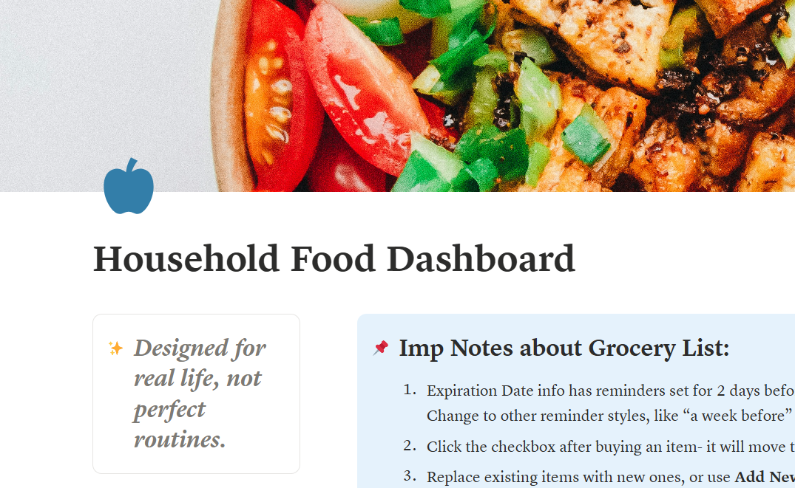

---

A Reddit user reached out looking for a Notion template that didn't quite exist yet. With her permission, here's how I built it and what I learned along the way.

## The Request

A Reddit user reached out looking for a custom grocery and meal planning setup in Notion. She had searched for different templates but didn’t find one that specifically catered to her constraint.

**Her main requirements:**

- A grocery list organized by category, with a checkbox per item. Specifically, she wanted checked items to move to the bottom of the list (i.e., purchased items) instead of disappearing. 
- A meal planner with space for recipes (manual entry or URL), connected to the grocery list table.

She shared two screenshots of a Notion setup she was already working with as a reference. It was useful as more of a base than a finished system.

**Real-life context:** two young kids, busy household, and by her own words, a brain "not firing on all cylinders."

### Pain points identified:

- Existing templates either hid completed items or removed them entirely: neither worked for her
- Too many things to remember across grocery and meal planning → decision fatigue
- No space for recipes in a format that felt manageable

**Starting mood level:** Moderate | **Urgency:** Low — user confirmed no rush

## Building It: Problems and How I Worked Around Them

While building the custom notion template, some parts were simple to navigate while others needed workaround. For full transparency, I am adding the whole list from my Process Notes at the time. 

| **Problems Noticed** | **Solutions Found** |
|---|---|
| I could not figure out how to move the items automatically to the bottom. Online showed Sort > Descending as the way to go. | Sort > Ascending worked instead. |
| Clicking on ‘Add Item’ to add items to the list was showing the prompt “Would you like to remove sorting?” each time. Clicking remove was breaking Relation and the popup was appearing too many times. UX concern: It might cause user frustration. | Added an information section with disclaimer about this for easier understanding and to reduce panic. |
| The previous version was usable but not intuitive. | Added feature to pull grocery items to meal planner database, added expiration date with reminder in grocery list database. |

*The information note; point 4 addresses the "Don't remove" issue directly.*

## Additional Decisions (Designer’s Perspective)

Here’s the design approach I followed:

- Prioritized function over aesthetics
- Maintained familiarity with the user’s reference formats
- Designed guardrails to prevent accidental system breakage
- Used a calm, neutral color palette to avoid visual overwhelm
- Avoided unnecessary quotes or decorative callouts despite personal design preferences

A couple of additions went beyond the brief entirely.

**Two additions I included without being asked**

- An expiration date column with reminders in the grocery database, to reduce the mental load of remembering what needed to be used soon.
- A relation feature that pulls grocery items directly into the meal planner, so the two sections talk to each other.

**Version 1 delivered: 18-01-2026**

## User Feedback

She came back a few days after receiving the template:

_"It works great! The only thing I did was move the bought column to the front so it's easier to check off."_

Moving the Bought column to the front on mobile is actually the right call. Notion doesn’t allow column resizing on mobile, so front-positioning made checking items faster and easier. She’d solved a usability issue I hadn’t fully considered. **I realized that users often reveal the smartest improvements through real use.** 

The user also mentioned the expiration date column specifically: "The expiry date column is super helpful!". This was something I'd included as an add-on, so I was glad she found it useful.

*Checked item moves to the bottom, not gone. Meal Planner with the Grocery List relation below.*

## An Update I Didn't Expect

When I reached out months later to ask permission to write this case study, she said yes and then added something I hadn't anticipated.

She'd modified the template herself in two ways: 

- A reset button at the top to clear the grocery list at the start of each week
- A Week Meals callout section for a quick weekly meal overview.

Both are genuinely smart additions. The reset button in particular solves a real weekly friction point I hadn't designed for. The Week Meals callout is a lightweight way to see the full week at a glance without opening the full meal planner database.

### What I learned

A template that's easy to adapt is just as important as one that works out of the box. I hadn't thought of including a reset mechanism and now it's something I'll consider for future tools where recurring resets are part of the natural workflow.

## What I took away from this

Building for a real, specific person is different from building a general-purpose template. The constraints were clearer, but the stakes felt higher. Someone was actually going to use this in their daily life that would complement their lifestyle, fit around their stressors and how they operate.

The most useful design decision in this case was not adding a feature or aesthetic element. It was the information note that I added "when Notion asks you this, click Don't Remove". Preventing user frustration in a moment of confusion is just as much a design problem as the layout itself.

---

### Please Note
_The Household Food Dashboard is a custom build and is not currently available as a public template. If you're interested in a similar custom project, you can reach out via the [Contact](/contact) page._
