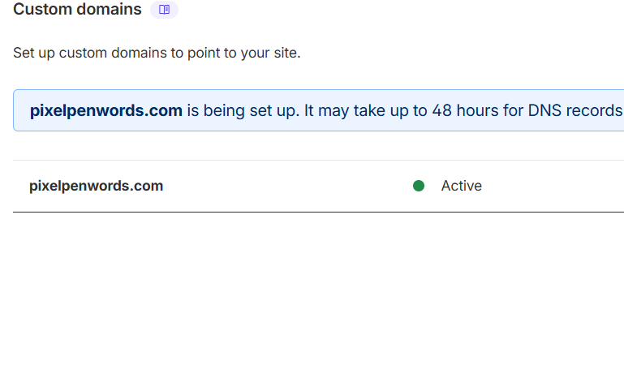

---

_20th April, 2026._

Sometime late at night. I was sitting in my room, supposedly working on preparing my work update for our weekly meeting, but actually making small refinements in my site. Nothing major; just updating published dates on my tools, refining homepage copy, and making last-minute tweaks.

I looked through everything one last time, checking that my internal links were working, all the social media links were added, and the site loads correctly in day and night mode.

Finally, when I couldn't find any major pending error and everything seemed to work well enough, I made the final GitHub push, and focused on learning how to deploy on Cloudflare pages. 

## The feeling I didn't expect

I did struggle a bit at first (was mistakenly using the Workers path instead of Pages) but within 30 minutes or so, I deployed. Waited a few minutes and then checked my site in the browser.

Loaded twice, didn't work. On the third reload… it was up. Pixelpenwords.com. Right there in the space where I usually type everyone else's sites… now blinking with my site’s domain. Active.

I waited for the swell of emotions to come because really, that's my default setting… but nothing.

No fireworks. No “I did it… I really actually did it.”

Reality felt… different. All I could think about in that moment was:

- I still hadn't set up my subscription form with an email provider
- The icon on the browser tab was still showing the Astro icon
- I still had Google Search Console to figure out. 

So I ignored the feeling (or lack of it) and continued with the next task that I couldn't stop focusing on: the Astro icon on top of the browser tab. 

Well, after I attended my office work update meeting, of course. (Worry not, I wasn't working on my site during my working hours…much. Those update meetings happen once a week at night during night department team's timing, but I digress.)

## The deeper realisation

My lack of reaction from finally launching my site didn't really hit me until the next day. It had been at the back of my mind throughout the day, but I didn't really sit and think about it. I had work responsibilities to do and also figure out the email subscription thing in my free time.

Why didn’t I feel excited after making my site live?

Why did it feel more fake than fulfilling?

Then it dawned on me.

I couldn’t feel excited because, to me, it didn’t feel like I had struggled enough or did much to earn the achievement. It felt anticlimactic; I hadn't written the code myself from scratch, nor had I gone through months of daily grind hours into the night like real developers and creators do.

Did I struggle? I lost my mind more than once because VS Code lines turned red while I was only renaming imports, yes, but did I really spend every waking moment of my free time on this?

**Not really.**

It didn't feel long enough, intense enough, or character-defining enough as I had imagined it to be. 

But I guess that's what the issue was. I imagined that there needed to be extreme struggle for something to be legitimate when maybe real building can appear in a different way.

## Lesson

This is somewhat embarrassing to admit but I think I was expecting launch day to validate me. I wanted the story of struggle, to know I suffered through long sleepless hours to bring my idea to life when reality was not as dramatic.

It took launch day feeling strangely anticlimactic for me to understand the point. 

_One doesn't have to suffer for six more months just so success would feel more earned. The point always was to build the thing._
_And now it exists._

## Closing

I still have loads to do. I still need to figure out the forms (my next tool to learn: Beehiiv), write more articles, set up SEO, and start working on App 1.

Life isn't going to pause to congratulate me. 

But I do recognize and finally feel something positive:

**I made something and I shipped it. For now that's enough.**

---