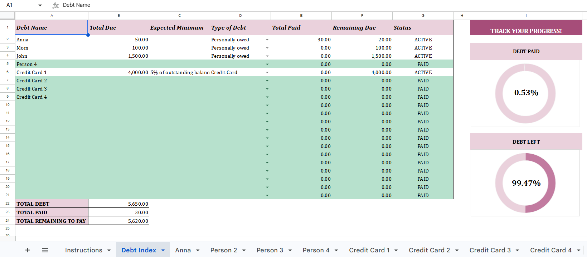

<h3>Simplify your debt payoff journey</h3>

Pay what you want, starting at $5

Secure checkout · Beginner-friendly · Google Sheets-compatible

<a href="https://pixelpenwords.gumroad.com/l/debt-management-dashboard" class="buy-btn" target="_blank">
Get it on Gumroad →
</a>

**Project Overview:**

The Debt Management Dashboard is an easy-to-use, automated spreadsheet template designed to help you organize and pay down your debts efficiently. Whether you are tracking credit card balances, personal loans, or money owed to friends and family, this tracker automatically calculates your remaining balances and visually displays your progress. Let this dashboard do the heavy lifting while you focus on regaining financial stability.

_**Note: A comprehensive video tutorial is available directly in the gallery below. You can watch it to see how the dashboard is supposed to work.**_

## Useful For

- Individuals wanting to visually track their debt payoff journey
- People managing multiple credit cards, loans, or personal IOUs
- Anyone looking for an automated, currency-neutral financial tracker
- Those who prefer straightforward spreadsheets over complex budgeting apps
- Goal-setters who are motivated by progress charts and visual milestones

## Features

- Master Debt Index dashboard tracking up to 20 unique debts
- Automated visual donut charts showing overall Debt Paid vs. Debt Left
- Individual debt tracking sheets with auto-updating Paid vs. Remaining pie charts
- Payment log tables that automatically calculate remaining balances after each entry
- Color-coded status indicators (Active/Paid) and step-by-step setup instructions

## How to Get It 

1. Click the **Get it on Gumroad** button above.  
2. You’ll be redirected to my secure Gumroad checkout page.  
3. Enter any amount you’d like (starting at $5).  
4. Download instantly after checkout.  
5. Open the Access Template PDF inside. You'll find the instructions to 'Get Template' and make your copy inside the PDF. 

## Please Note
_This paid template is offered as **pay what you want**, starting at $5._

_If it helps you, feel free to support my work!_

_Unfortunately, I don't offer a free version of this spreadsheet at the moment. You can browse my profile; there are other digital products I do offer starting at $0 if you're interested._

<h2>PREVIEW THE TEMPLATE</h2>

  

  

  

   <video controls preload="metadata">
    <source src="/videos/tool-4-demo.mp4" type="video/mp4">
  </video>
  </a>

