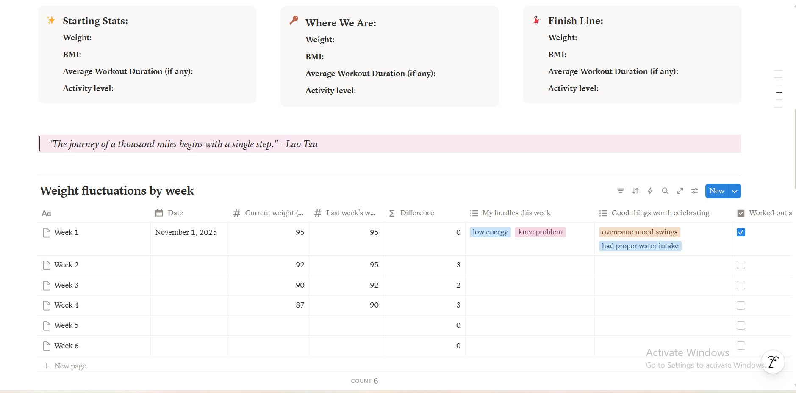

<h3>Track workout progress easily </h3>

Pay what you want, starting at $4.99

One-time purchase · Instant access · Use forever 

<a href="https://pixelpenwords.gumroad.com/l/glow-up-tracker-home-workout" class="buy-btn" target="_blank">
Get it on Gumroad →
</a>

**Project Overview:**

Glow-Up Tracker (Home Workout Edition) helps you build a sustainable fitness routine from home. Track weekly weight changes, body measurements, habits, and see visual progress. Everything in one organized space designed to keep you focused on consistency, not perfection.

## Useful For

- Beginners starting a sustainable home workout routine
- Individuals wanting to track body measurements beyond the scale
- Fitness enthusiasts looking to log weekly hurdles and wins
- Goal-setters aiming to build consistent daily physical habits
- Anyone needing a visual gallery for progress and motivation

## Features

- Weekly weight fluctuation database with hurdle and win tracking
- Detailed body measurement log to monitor true fat loss
- Starting, current, and finish line stat overview dashboards
- Stay inspired with a visual progress gallery that reminds you how far you’ve come
- Built-in fitness equipment wishlist and beginner-friendly helpful notes

## How to Get It 

1. Click the **Get it on Gumroad** button above.  
2. You’ll be redirected to my secure Gumroad checkout page.  
3. Enter any amount you’d like (starting at $4.99).  
4. Download instantly after checkout.  
5. Open the template in Notion and duplicate it to your workspace.

## Please Note
_This template is offered as **pay what you want** starting at $4.99. If it helps you, feel free to support my work._

_If money is tight right now, you can get it for free through my [Notion Marketplace](https://www.notion.com/templates/glow-up-tracker-home-workout) profile._

_Since payments through Notion Marketplace aren’t supported in my country, I publish my free templates there, including **V_1** of Glow-Up Tracker (Home Workout Edition)._

<h2>PREVIEW THE TEMPLATE</h2>

  

  

  

  

