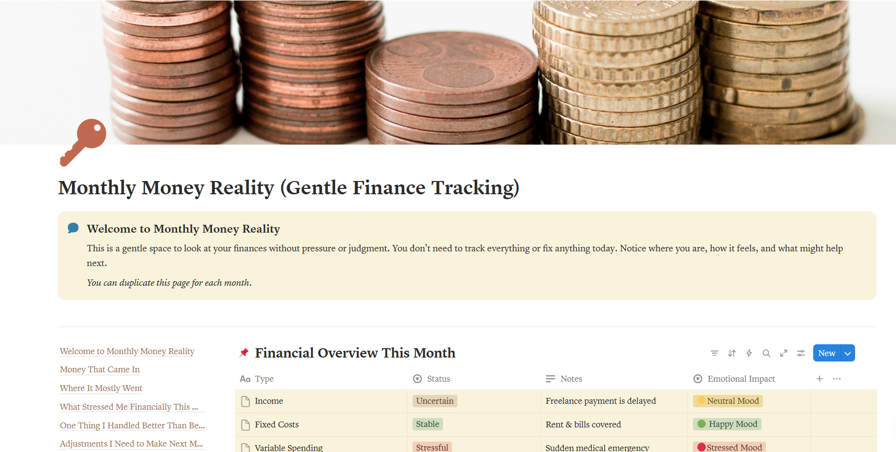

<h3>Get clarity on your financial reality</h3>

Pay what you want, starting at $0

Secure checkout · Instant download · desktop + mobile Notion

<a href="https://pixelpenwords.gumroad.com/l/monthly-money-reality" class="buy-btn" target="_blank">
Get it on Gumroad →
</a>

**Project Overview:**

Monthly Money Reality is a pressure-free Notion template created to help you observe your financial habits gently. Instead of rigid budgeting, it focuses on awareness; tracking what came in, where it went, how it felt, and what small adjustments you can make next. It’s a calm space to sit with your money reality without the overwhelm.

## Useful For

- Individuals seeking a gentle, non-judgmental approach to money management
- Anyone easily overwhelmed by complex, rigid budgeting apps
- People wanting to understand the emotional impact of their spending
- Freelancers and creators with variable or uncertain incomes
- Those looking to celebrate small financial wins and make gradual adjustments

## Features

- High-level financial overview dashboard with emotional impact tracking
- Simple, straightforward tables for "Money That Came In" and "Where It Mostly Went"
- Dedicated space to reflect on what stressed you financially this month
- Reflection list to celebrate the money habits you handled better than before
- Actionable checklist to set gentle, practical adjustments for the next month

## How to Get It 

1. Click the **Get it on Gumroad** button above.  
2. You’ll be redirected to my secure Gumroad checkout page.  
3. Enter any amount you’d like (starting at $0).  
4. Download instantly after checkout.  
5. Open the template in Notion and duplicate it to your workspace.

## Please Note
_This template is offered as **pay what you want**._
_If it helps you, feel free to support my work._
_If money is tight right now, you’re welcome to download it for free._

<h2>PREVIEW THE TEMPLATE</h2>

  

  

  

  

